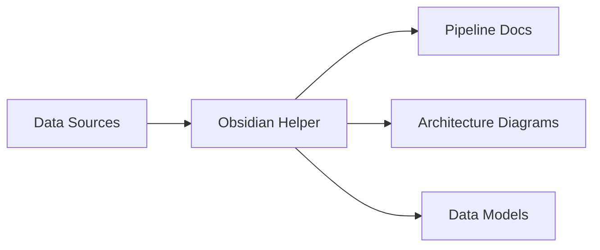

# 🗒️ Obsidian Helper

A comprehensive web-based tool for Obsidian users that provides ready-to-use templates for creating beautiful documentation, especially focused on data models, data engineering, and data architecture.


## ✨ Features

### 📋 Template Categories
- **Todo Lists** - Basic, prioritized, and project-based task lists
- **Icons & Symbols** - Curated collection of emojis and symbols for documentation
- **Tables** - Various table formats for data documentation
- **Code Blocks** - Syntax-highlighted code templates for multiple languages
- **Data Models** - Entity documentation, data dictionaries, and ERD templates
- **Architecture** - Data flow diagrams, platform overviews, and lakehouse patterns
- **Callouts** - Note, warning, info, success, error, and tip callouts
- **Diagrams** - Mermaid diagrams including flowcharts, sequence, state, and Gantt
- **Canvas** - Templates specifically designed for Obsidian Canvas feature
- **JSON Formatter** - Parse and format JSON with multiple output styles including nested tables
- **DBDiagram Parser** - Convert dbdiagram.io schemas to documentation tables and diagrams

### 🚀 Key Functionality
- **One-Click Copy** - Click any template to copy it to your clipboard
- **Direct Obsidian Insert** - Insert templates directly into your Obsidian vault
- **Dark Theme** - Matches Obsidian's default aesthetic
- **Keyboard Shortcuts** - Use Ctrl/Cmd + 1-9 to quickly switch sections
- **Settings** - Configure your vault name and preferences
- **Auto-Copy Option** - Automatically copy to clipboard when inserting to Obsidian

## 🛠️ Initial Setup Guide

### Step 1: Finding Your Vault Name

Your vault name is the name of your Obsidian workspace. To find it:

1. **Open Obsidian**
2. **Look at the window title** - it shows "Vault Name - Obsidian"
3. **Or click the vault name** in the bottom-left corner


### Step 2: Configure Obsidian Helper

1. **Open `index.html`** in your web browser
2. **Click the ⚙️ settings button** in the top-right corner
3. **Enter your vault name** exactly as it appears in Obsidian
4. **Optional**: Enable "Auto-copy on insert" if you want templates copied to clipboard too
5. **Click Save**

### Step 3: First-Time Use

When you first click "🚀 Insert to Obsidian":
- A popup will ask for your vault name if not set
- Enter it once, and it's saved for future use
- You can change it anytime in settings

## 📝 How to Use

### Method 1: Copy to Clipboard
1. Browse templates using navigation buttons
2. Find the template you want
3. Click **"📋 Copy"**
4. Paste into your Obsidian note (Ctrl/Cmd + V)


### Method 2: Direct Insert to Obsidian
1. Click **"🚀 Insert to Obsidian"** on any template
2. Obsidian will automatically open
3. A new note will be created with the template
4. Save the note in your desired location

### Keyboard Shortcuts
- `Ctrl/Cmd + 1-9` - Quick switch between template sections
- `Ctrl/Cmd + 0` - Jump to JSON Formatter
- `Esc` - Close any open modal

## 🎨 Using Canvas Templates

The Canvas section provides templates specifically designed for Obsidian's Canvas feature:

### Creating a Canvas from Templates

1. **Navigate to Canvas section** (last tab)
2. **Choose a canvas template**:
   - Project Planning Canvas
   - Data Pipeline Canvas
   - System Architecture Canvas
   - Knowledge Graph Canvas
3. **Click "🚀 Insert to Obsidian"**
4. **In Obsidian**:
   - Save the note
   - Create a new Canvas (right-click in file explorer → New Canvas)
   - Drag the note into the canvas
   - Start building your visual workspace!

### Canvas Best Practices


1. **Use Color Coding**:
   - 🟦 Blue for data sources
   - 🟩 Green for processing steps
   - 🟨 Yellow for storage
   - 🟥 Red for issues/blockers

2. **Create Connections**:
   - Draw arrows between related nodes
   - Use different line styles for different relationships
   - Add labels to connections for clarity

3. **Group Related Items**:
   - Use frames to group related concepts
   - Create visual hierarchies with node sizes
   - Maintain consistent spacing

## 🎯 Use Cases

### For Data Engineers


- Document ETL pipelines with structured templates
- Create data quality checklists
- Design data flow diagrams
- Track dependencies and lineage

### For Project Managers
- Organize project tasks with prioritized todo lists
- Create stakeholder matrices
- Document risks and mitigations
- Build project timelines with Gantt charts

### For Knowledge Workers
- Build interconnected knowledge graphs
- Create structured documentation
- Organize research and notes
- Maintain best practices libraries

## 🔧 Troubleshooting

### Common Issues

**"Obsidian doesn't open when I click Insert"**
- Make sure Obsidian is installed on your computer
- Check that your vault name is correctly entered (case-sensitive)
- Try copying the vault name directly from Obsidian

**"The template appears garbled"**
- Ensure you're using a recent version of Obsidian
- Check that you have necessary plugins enabled (e.g., for Mermaid diagrams)

**"Settings aren't saving"**
- Check if your browser allows local storage
- Try a different browser if issues persist
- Clear browser cache and try again

### Browser Compatibility
- ✅ Chrome/Edge (Recommended)
- ✅ Firefox
- ✅ Safari
- ⚠️ Internet Explorer (Not supported)

## 🔧 JSON Formatter

The JSON Formatter provides powerful tools for working with JSON data:

### Features
- **Pretty Print** - Format JSON with proper indentation
- **Compact** - Minify JSON to single line
- **Markdown Code Block** - Wrap in ```json``` blocks
- **Simple Table** - Convert to basic markdown table
- **Nested Tables** - Convert complex nested JSON to multiple related tables

### Nested Tables Feature
Automatically analyzes complex JSON structures and creates:
- Separate tables for nested objects and arrays
- Cross-references between related data
- Type information for each field
- Summary statistics

Perfect for documenting API responses, configuration files, and complex data structures.

## 📊 DBDiagram Parser

Convert dbdiagram.io table definitions to various documentation formats:

### Input
Paste your dbdiagram.io schema definition with:
- Column definitions with types
- Constraints (pk, unique, not null, etc.)
- Foreign key references
- Comments for section organization

### Output Formats

#### 1. **Full Documentation Table**
8-column comprehensive table with:
- Column name, type, definition (empty)
- Constraints, source/mapping (empty)
- Transformation logic (empty)
- Example values (auto-generated)
- Notes section (empty)

#### 2. **Visual Table (Markdown)** ⭐ Recommended
Beautiful markdown table with:
- 🔑 Visual indicators for constraints
- Section headers from comments
- Relationship diagrams
- Quick statistics summary

#### 3. **Mermaid Diagram**
Native Obsidian diagrams including:
- Entity relationship diagram
- Visual table structure
- Class diagram with constraints

#### 4. **Data Dictionary**
Detailed documentation format with each column fully described.

### Example Workflow
1. Design your schema in dbdiagram.io
2. Copy the table definition
3. Paste into DBDiagram Parser
4. Select "Visual Table" for best Obsidian compatibility
5. Copy result to your documentation

## 🚀 Advanced Tips

### Creating Custom Templates
1. Use any template as a starting point
2. Modify in Obsidian
3. Save as a template note
4. Combine with Obsidian's Templater plugin for dynamic content

### Workflow Integration
- Use with Obsidian's Daily Notes for consistent formatting
- Combine with Dataview plugin for dynamic lists
- Create template hotkeys in Obsidian for faster access

### Canvas Workflows
1. **Mind Mapping**: Use Knowledge Graph template
2. **System Design**: Start with Architecture Canvas
3. **Project Planning**: Use Project Planning Canvas
4. **Process Documentation**: Try Data Pipeline Canvas

### JSON Documentation Workflow
1. Copy API response
2. Use JSON Formatter with "Nested Tables"
3. Document each table's purpose
4. Link tables in your knowledge base

### Database Documentation Workflow
1. Export schema from dbdiagram.io
2. Use "Visual Table" format
3. Fill in descriptions and mappings
4. Create linked notes for each table

## 🤝 Contributing

We welcome contributions! Here's how:

1. **Suggest Templates**: Open an issue with your template idea
2. **Submit Code**: Fork the repository and submit a pull request
3. **Report Bugs**: Create an issue with reproduction steps
4. **Improve Docs**: Help us make the documentation better

### Development Structure
```
obsidian-helper/
├── index.html      # Main application and templates
├── styles.css      # All styling
├── script.js       # Functionality and interactions
└── README.md       # This file
```

## 📄 License

This tool is free to use and modify for personal and commercial purposes.

## 🙏 Acknowledgments

Made with ❤️ for the Obsidian community. Special thanks to:
- Obsidian developers for the amazing tool
- Data engineers and architects who inspired these templates
- The open-source community for continuous improvements

---

**Quick Start**: Open `index.html` → Set vault name → Start using templates!

**Need Help?** Check the [Obsidian Forum](https://forum.obsidian.md/) or create an issue.